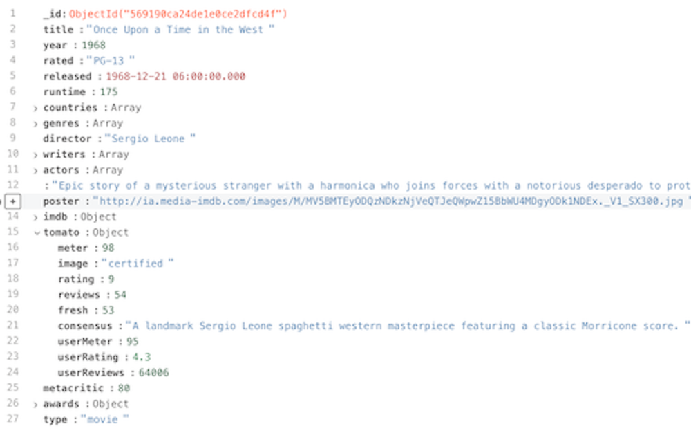

<!-- .slide: class="sfeir-basic-slide" -->
# Qu'est ce réellement le NOSQL
   
NOSQL signifie Not Only Structured Query Language
  
Ce qui implique :
  
- Pas de clé primaire
- Pas de Table
- Pas de Colonne
   

  Comment représenter donc facilement et lisiblement nos données ? 

##==##

<!-- .slide: class="sfeir-basic-slide" -->
# Représentation de nos données
   

  

    <h4>Les Documents</h4>
      
    <ul>
      <li>Référencement possible</li>
      <li>Destructuration possible</li>
      <li>Format Objet (BSON)</li>
    </ul>
  

  

    
  

##==##

<!-- .slide: class="sfeir-basic-slide"-->
# Le format Object BSON
  

  <strong>BSON (Binary JavaScript Object Notation)</strong>

  
- Definition : BSON est une sérialisation codée en binaire de document de type JSON
  
- Étend les types classiques JSON et en ajoute de nouveaux
  
- Possède les propriétés suivantes
 - <strong>Lightweight</strong>
 - <strong>Traversable</strong>
 - <strong>Efficient</strong>
Notes: 
- BSON apporte son lot de nouveaux types. Pour ne citer que les plus célèbres: ObjectId; Timestamp; Decimal128 (utile pour les banques, permet d'avoir une précision extrèmement fine sur la valeur)
- Pourquoi ces propriétés ?
   - Lightweight: Le BSON est une sérialisation codée en binaire, par définition le binaire est léger. Propriété très avantageuse, rappelons que l'on peut mettre une base MongoDB dans le cloud. Le fait que le document soit LightWeight est très important dans ce cas de figure
   - Traversable: Lire un document BSON est très rapide, gain de performance lorsque l'on exécute une query
   - Efficient: Encoder et décoder des Datas BSON peuvent être réalisés très rapidement dans beaucoup de languages. Ce principe est fortement dû à l'utilisation du C data type

##==##

<!-- .slide: class="sfeir-basic-slide" -->
# Champs lexical de MongoDB
   
- <strong>document</strong> : un document représente une entité (exemple un utilisateur)
  
- <strong>collection</strong> : une collection représente un ensemble d'entités.
  
- <strong>MongoDB</strong> : Technologie regroupant un ensemble de bases de données de type Msongo
  
Notes: 
- Quand on parle de MongoDB, on fait souvent l'association MongoDB égal base de données. Cette association est complètement fausse. MongoDB est une technologie qui permet de stocker différentes bases de données NO SQL de type Mongo.
- Quand on lance MongoDB, on lance une sorte de container contenant plusieurs bases de données.
- Information importante: un document ne peut pas dépasser une taille de 16 Megabytes. Pourquoi? La réponse d'une query se stocke en Ram, cette limite est mise en place pour ne pas excéder la Ram avec un unique document

##==##

<!-- .slide: class="sfeir-basic-slide" -->
# Transcription SQL NOSQL
 

  

 
