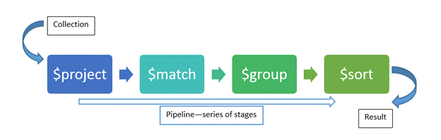

<!-- .slide: class="sfeir-basic-slide"-->
# Aggregation Pipeline
 

  

  
<ul>
  <li>Une aggregation pipeline est composé de stage</li>
   
  <li>Chaque stage est composé d'un ou plusieurs opérateurs</l<<i>

##==##

<!-- .slide: class="sfeir-basic-slide"-->
# Les stages les plus classiques
 

  
$match

  
$project

  
$skip

  
$limit

  
$sort

 

  
$unwind

  
$group

  
$lookup

  
$addFields

 
Notes:
 - Il en existe bien plus que ça! La documentation est votre meilleurs ami. Ici se trouve les plus courants
 documentation: https://docs.mongodb.com/manual/meta/aggregation-quick-reference/
 
##==##

<!-- .slide: class="sfeir-basic-slide"-->
# Les opérateurs les plus classiques
 

  
$add

  
$addToSet

  
$push

 

  
$avg

  
$sum

  
$multiply

 

